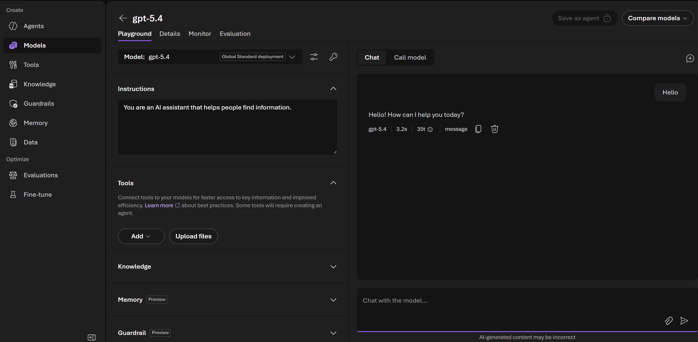

# Challenge 0: Create your Foundry project

Time: ~25 minutes

## Objectives

By the end of this challenge, you will have:

- ✅ A Microsoft Foundry resource and project created from the Azure portal
- ✅ A chat model deployed and tested in the playground
- ✅ Application Insights connected to your project, ready for Challenge 2


## Prerequisites

- A modern web browser
- An Azure subscription where you have the **Contributor** and **Azure AI User** roles
- The name of the Azure **region** your proctor asked you to use (this lab uses **Sweden Central**)

> [!NOTE]
> There is nothing to install. Do not clone the repository, create a virtual environment, or use a terminal — everything below happens in the browser.

---

## Step 1 — Create the Microsoft Foundry resource

1. Go to [portal.azure.com](https://portal.azure.com) and sign in.
2. In the top search box, type **Azure AI Foundry** and select it from the **Services** results.
3. Select **+ Create**, then **Azure AI Foundry**.
4. Fill in the **Basics** tab:

   | Field | Value |
   |---|---|
   | **Subscription** | The subscription your proctor assigned |
   | **Resource group** | Select **Create new** and name it `rg-aigro-<your-initials>` |
   | **Region** | **Sweden Central** (or the region your proctor gave you) |
   | **Name** | `foundry-aigro-<your-initials>` — must be globally unique |
   | **Project name** | `aigro-tech-project` |

5. Leave every other tab at its default. Select **Review + create**, then **Create**.
6. Wait for **Your deployment is complete**, then select **Go to resource**.

> [!TIP]
> Use short, lowercase names with no spaces. If the portal says the name is taken, add a number to the end.

Your resource group should now look similar to this:


> [!NOTE]
> Resource name prefixes vary by scenario, and suffixes are unique to each deployment. Your list will not match exactly.

---

## Step 2 — Open the project in the Foundry portal

1. Go to [ai.azure.com/nextgen](https://ai.azure.com/nextgen) and sign in with the same account.
2. If you are not taken to your project automatically, use the project picker in the top-right corner and select **aigro-tech-project**.


Keep this tab open — you will spend the rest of the lab here.

---

## Step 3 — Deploy a model

1. In the top navigation, select **Build**, then **Models** in the left sidebar.

   > [!NOTE]
   > In some versions of the Foundry portal the **Models** tab is named **Deployments**. Both serve the same purpose.

2. Select **+ Deploy model** → **Deploy base model**.
3. Search for a chat model — this lab was written for **gpt-5.4**. If it is not offered in your region, pick the newest GPT chat model your proctor approves.
4. Select the model, then **Confirm**.
5. Keep the **Deployment name** as suggested and note it down — you will pick this model when you create each agent.
6. Select **Deploy** and wait until the status shows **Succeeded**.


---

## Step 4 — Test the model in the playground

1. Select your deployment, then **Open in playground**.
2. Type a simple message, for example:

   ```text
   In one sentence, what does a soil moisture reading of 18% suggest for a strawberry crop?
   ```

3. Send it and confirm you get a response.



If you get an error here, stop and fix it before continuing — every later challenge depends on a working model deployment.

---

## Step 5 — Connect Application Insights

You need this for Challenge 2. Setting it up now means Challenge 2 is pure exploration.

1. In the Foundry portal, go to **Observability** → **Tracing** in the left sidebar.
2. If you see the banner **"Create or connect an App Insights resource to get started"**, select **Connect**.
3. In the panel, either pick an existing Application Insights resource or select **Create new** and accept the suggested name.
4. Confirm. The banner disappears and the Tracing view becomes available.

> [!NOTE]
> The Tracing view will be empty for now — that is expected. You generate traces in Challenge 1 and read them in Challenge 2.

<!-- TODO: screenshot — Observability > Tracing "Connect App Insights" panel -->

---

## Success criteria

- [ ] Your resource group in the Azure portal contains a Microsoft Foundry resource
- [ ] You can open **aigro-tech-project** at [ai.azure.com/nextgen](https://ai.azure.com/nextgen)
- [ ] Your model deployment shows the status **Succeeded**
- [ ] You received a response in the model playground
- [ ] **Observability → Tracing** shows a connected Application Insights resource, not the connect banner

Next: [Challenge 1 — Build agents](../challenge-1-build/README.md)
