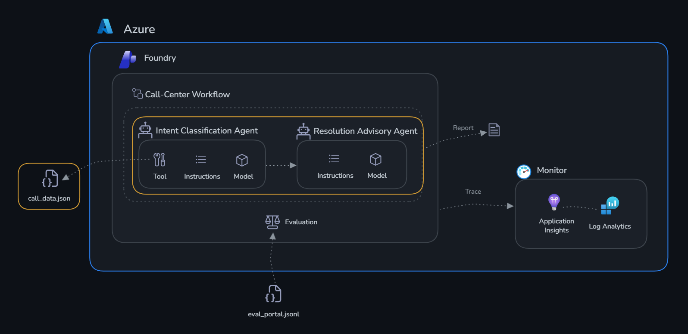

# Challenge 1: Build agents

Time: ~40 minutes

## Objectives

By the end of this challenge, you will have:

- ✅ A **Classifier Agent** that compares each zone's readings with its thresholds and reports status
- ✅ An **Advisor Agent** that turns those findings into agronomic recommendations
- ✅ An **OpenAPI tool** attached to the Classifier so it reads live farm data
- ✅ An **Azure AI Search tool** attached to the Advisor so it can cite approved treatment products



## Context

GreenRise AgroTech monitors five growing zones at the Smart Farm Demonstration. Each zone has a crop, four metrics — `soil_moisture`, `temperature`, `humidity`, and `ph_level` — and its own `min` and `max` thresholds, so a reading that is safe in one zone can be an emergency in another. Your agents need to:

1. **Classification**: compare every reading with that zone's thresholds and mark each metric 🔴 critical, ⚠️ warning, or ✅ normal, including any recorded issues
2. **Advisory**: given that classification, recommend irrigation, disease, and escalation actions — and look up treatment products when pests are present

---

## Concepts before you click

### What is an agent?

An agent in Microsoft Foundry is a persistent AI assistant powered by a large language model. Unlike a single chat message, an agent keeps a **conversation**, can **call tools on its own**, and **keeps context** across turns. You configure it with:

- A **name** and a **model** (the one you deployed in Challenge 0)
- **Instructions** — a system prompt that defines its role and its limits
- One or more **tools** it may call when it needs information beyond its training data

Agents are saved in your project. They appear under **Agents**, and you can edit, version, and test them at any time.

### What are tools?

Tools extend an agent beyond language generation. When the model decides it needs information it does not have, it emits a **tool call**. Foundry executes the tool and hands the result back to the model, which then continues reasoning until it produces a final answer. You never write the decision logic — the model reads the tool's **name and description** and decides for itself.

> [!IMPORTANT]
> The tool **description** is the only thing the model uses to decide whether to call it. A vague description is the single most common reason an agent ignores a tool it should have used.

### Which tools can you add?

| Tool type | What it does | Used in this lab for |
|-----------|-------------|----------------------|
| **OpenAPI** | Calls a REST API you describe with a schema file | Reading the live farm data |
| **Azure AI Search** | Queries a search index built over your documents (RAG) | Finding approved pest-treatment products |
| **Code Interpreter** | Lets the agent write and run Python in a sandbox | Not used here — try it after the lab |
| **File Search** | Searches files you upload to the agent | Not used here — see the [wrap up](../wrapup.md) |


---

## The farm data and its API

The farm snapshot contains five zones with crop details, inspection dates, observed issues, and four readings per zone — each with a zone-specific minimum and maximum threshold. The stored statuses are two `warning` zones, one `critical` zone, and two `normal` zones.

A read-only REST API serves that dataset:

| Method | Route | Result |
|---|---|---|
| GET | `/farm` | Full farm snapshot |
| GET | `/zones` | All zones; accepts optional `zone_id` |
| GET | `/zones/{zone_id}` | One zone, matched case-insensitively |
| GET | `/zones/{zone_id}/readings` | All metric readings; accepts optional `metric` |
| GET | `/crops` | Crop summaries; accepts a case-insensitive partial `crop` filter |
| GET | `/swagger` | Interactive API documentation |

The API is already deployed and running — you do not need to host it.

> [!IMPORTANT]
> **Ask your proctor for the API URL.** The schema file in this folder contains a default URL that may point at a retired host. Confirm the current one before you continue, and open `<api-url>/swagger` in a browser to check it responds.

The schema file you will upload is [openapi.json](./openapi.json), in this folder. Download it to your machine now — the portal asks you to browse for a local file.

---

## Step 1 — Create the Classifier Agent

1. Open [ai.azure.com/nextgen](https://ai.azure.com/nextgen) and select your project.
2. In the top navigation select **Build**, then **Agents** in the left sidebar.
3. Select **+ New agent**.
4. Set the **Agent name** to:

   ```text
   smart-farm-classifier-agent
   ```

5. Set the **Model** to the deployment you created in Challenge 0.
6. Paste the following into the **Instructions** box, exactly as written:

   ```text
   ## Purpose
   -  You are AI assistant for GreenRise AgroTech that helps user to classify crops and zones.  Try load data via tools or use default thresholds =
   - soil_moisture = min: 30.0, max: 65.0
   - temperature: min: 12.0, max: 30.0
   - humidity: min: 45.0, max: 80.0
   - ph_level: min: 6.0, max: 7.0

   ## OutputFormat
   - Classification Summary table ONLY
   - rows = for each zone.
   - columns = for each metric
   - use 🔴 for critical, ⚠️ for high, and ✅ for low.
   - add column priority based on metrics classification
   - Show existing issues

   ## Scope
   - Before answering, check if the request is related to this Purpose.
   - If in scope: continue with conversation.
   - If out of scope: do not answer the request content. Just explain your purpose

   ## Guardrails
   - Do not create customer data.
   - Do not recommend anything
   - If key data is missing, ask precise follow-up questions.
   ```

7. **Save** the agent.

> [!NOTE]
> Notice the fallback thresholds in the instructions. Without a tool the agent can still classify readings you paste into the prompt. Attaching the tool in the next step is what grounds it in the real farm data.
>
> Notice also **"Do not recommend anything"** — this keeps classification separate from advice. That separation is the whole reason there are two agents.

---

## Step 2 — Attach the OpenAPI tool to the Classifier

1. With `smart-farm-classifier-agent` open, find the **Tools** section and select **+ Add**.
2. In the tool picker, open the **Custom** tab and choose **OpenAPI 3.0 specified tool**.
3. Fill in:

   | Field | Value |
   |---|---|
   | **Name** | `farm_api` |
   | **Description** | `Reads live GreenRise AgroTech farm data: zones, crops, sensor readings, and per-zone thresholds.` |
   | **Authentication method** | **Anonymous** |

4. On the **Define schema** step, select **Upload file** and choose the [openapi.json](./openapi.json) file you downloaded.
5. Check the `servers` URL shown in the schema preview. If it does not match the URL your proctor gave you, edit it in the preview before continuing.
6. Select **Create tool**.
7. Confirm the tool now lists the six `GET` operations.

<!-- TODO: screenshot — Add tool > Custom > OpenAPI 3.0 specified tool, schema upload step -->

---

## Step 3 — Test the Classifier

1. Open the agent's **Playground** (the chat panel next to the agent configuration).
2. Send this prompt to test the fallback thresholds — the readings are pasted in, so the agent does not need the tool:

   ```text
   Classify follow zones:
       Zone: ZONE-ALPHA
       Crop: Tomato
       Soil moisture: 52
       Temperature: 28
       Humidity: 60
       pH level: 6.5

       Zone: ZONE-BETA
       Crop: Lettuce
       Soil moisture: 70
       Temperature: 40
       Humidity: 90
       pH level: 8
       Issues: Ácaro-branco (Polyphagotarsonemus latus)
   ```

   You should get a summary table only — one row per zone, one column per metric, marked 🔴 / ⚠️ / ✅, plus a priority column and the recorded issue.

   

3. Now test the **tool**. Send:

   ```text
   Classify all zones on the farm using the current sensor data.
   ```

   The agent should call `farm_api` instead of asking you for readings. Expand the tool-call entry in the chat to see the request it made and the JSON it received back. The result should show **two warning zones, one critical zone, and two normal zones**.

> [!TIP]
> If the agent asks you for readings instead of calling the tool, the tool description is too vague or the API URL is unreachable. Open `<api-url>/zones` in a browser to confirm the API responds, then make the description more explicit.

---

## Step 4 — Create the Advisor Agent

1. Go back to **Build** → **Agents** → **+ New agent**.
2. Set the **Agent name** to:

   ```text
   smart-farm-advisor-agent
   ```

3. Set the **Model** to the same deployment.
4. Paste the following into the **Instructions** box, exactly as written:

   ```text
   ## Purpose
   -  You are advisor AI assistant for GreenRise AgroTech.

   Apply these patterns:
   - low soil moisture plus high temperature indicates irrigation stress;
   - high humidity plus low pH indicates fungal or disease risk;
   - multiple critical readings require urgent agronomist escalation.
   - Give practical actions, urgency, and what to recheck. Distinguish evidence from hypotheses and do not invent data.
   - if pests issues exist, then use existing tools for products recommendation (show link references)

   ## Scope
   - Before answering, check if the request is related to this Purpose.
   - If in scope: continue with conversation.
   - If out of scope: do not answer the request content. Just explain your purpose

   ## OutputFormat
   - Recommendation Summary bullets (Max 100 words - 3 bullets)
   ```

5. **Save** the agent.

---

## Step 5 — Attach the Azure AI Search tool to the Advisor

In this step you connect a pre-loaded Azure AI Search index. The index is built over treatment documents in a storage account, which gives the Advisor **RAG** (Retrieval-Augmented Generation) — it can cite approved products instead of inventing them.

1. With `smart-farm-advisor-agent` open, find the **Tools** section and select **+ Add**.
2. Choose **Azure AI Search**.
3. Select **Connect other Azure AI Search resource** (or **Select a resource**) and look for **search-hack-shared**. Select **Connect**.

   > [!NOTE]
   > If `search-hack-shared` does not appear, your project has no connection to it yet. Go to the **Management center** → **Connected resources** → **+ New connection** → **Azure AI Search**, add `search-hack-shared`, then return to this step. Ask your proctor if you cannot see the resource at all.

4. Select the index listed in the box.
5. Select **Add tool**.

<!-- TODO: screenshot — Add tool > Azure AI Search > select search-hack-shared and index -->

---

## Step 6 — Test the Advisor

Open the Advisor's playground and send the Classifier's findings as context:

```text
Classification summary:
- ZONE-ALPHA: soil moisture 26% (min 30) ⚠️, temperature 31.5°C (max 30) ⚠️
- ZONE-GAMMA: soil moisture 18% 🔴, temperature 35°C 🔴, humidity 91% 🔴, pH 5.1 🔴 — issue: Ácaro-branco (Polyphagotarsonemus latus)
- ZONE-EPSILON: humidity 84% (max 78) ⚠️, pH 5.4 (min 5.8) ⚠️

What should the field crew do today?
```

Check the response against the three patterns in the instructions:

- ZONE-ALPHA — low soil moisture plus high temperature should produce an **irrigation** action
- ZONE-EPSILON — high humidity plus low pH should produce a **fungal or disease** investigation
- ZONE-GAMMA — multiple critical readings should produce an **urgent agronomist escalation**, and the pest issue should trigger a **product recommendation with a link reference** from the search index

> [!TIP]
> If the Advisor recommends a product but shows no link, the search tool was not called. Ask directly: *"Which approved products treat Ácaro-branco?"* and expand the tool call to see what the index returned.

---

## Success criteria

- [ ] Both agents appear in your project under **Agents**
- [ ] The Classifier returns a summary table covering all four metrics with 🔴 / ⚠️ / ✅ and a priority column
- [ ] The Classifier calls the `farm_api` tool and identifies two warning zones, one critical zone, and two normal zones
- [ ] The Advisor recommends an irrigation action for low soil moisture plus high temperature
- [ ] The Advisor recommends fungal or disease investigation for high humidity plus low pH
- [ ] Multiple critical readings produce urgent agronomist escalation
- [ ] The Advisor cites a product with a link reference for the pest issue

Next: [Challenge 2 — Monitor](../challenge-2-monitor/README.md)
