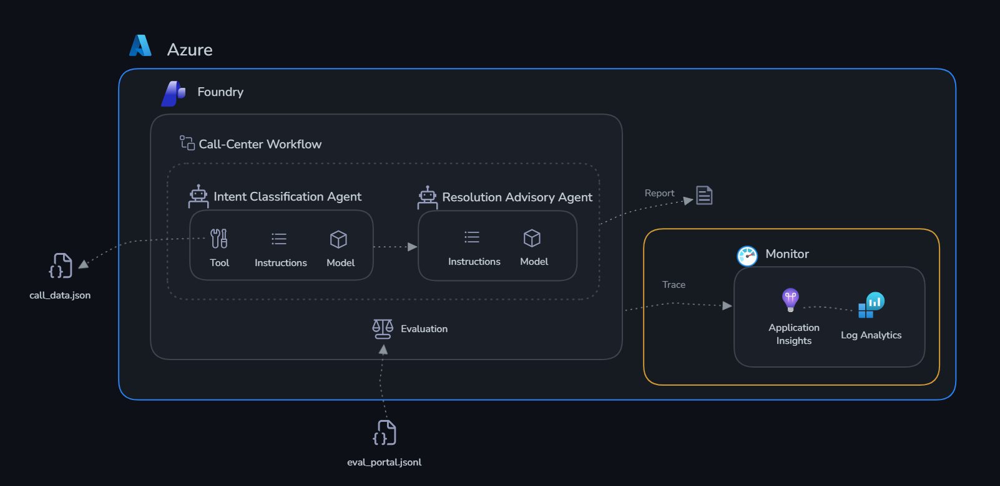
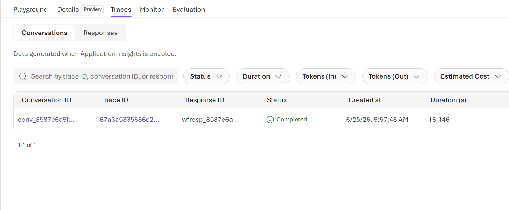
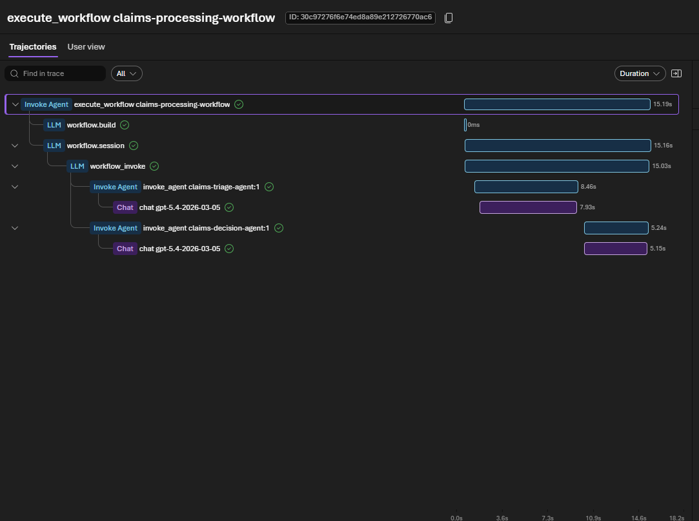
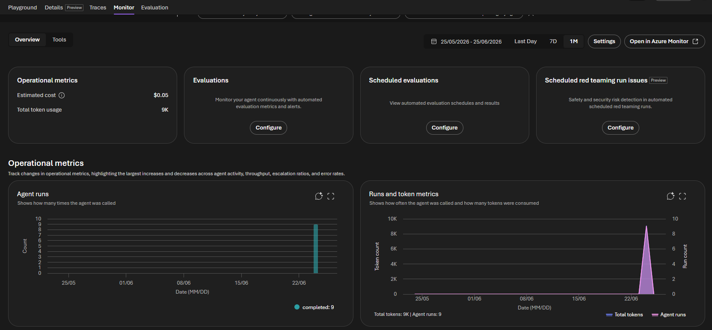
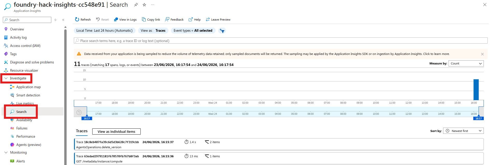
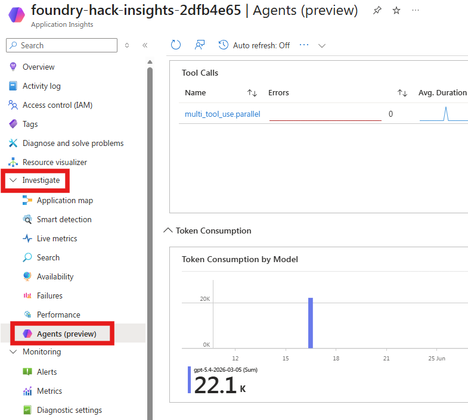

# Challenge 2: Monitor your agents

Time: ~20 minutes

## Objectives

By the end of this challenge, you will have:

- ✅ Generated real agent traffic and found it in the **Tracing** view
- ✅ Opened a trace and read its spans, tool calls, tokens, and latency
- ✅ Read the **Monitoring** dashboard and the Application Insights **Agents** dashboard
- ✅ An understanding of how to debug agent behaviour in production



## Context

Your agents work — but how do you know whether they are working **well**? What if the Classifier marks ZONE-GAMMA as normal on a day it is critical? What if the Advisor takes 30 seconds to respond during the morning field review?

**Tracing** gives you:

- A complete record of every agent run — user message → model call → tool calls → response
- Token usage and estimated cost per request
- A latency breakdown across the model and each tool
- Error tracking

## Why monitor?

AI agents behave differently from traditional software. A conventional API returns the correct data or throws an error — you can test it deterministically. An agent's output is probabilistic: the same input can produce subtly different responses on each run, tool calls can succeed and still return unexpected data, and failures can be silent (the agent responds confidently but incorrectly). Without observability, these problems stay invisible until someone in the field reports them.

Monitoring serves three critical functions:

- **Reliability** — Detect when agents stop working (failed tool calls, timeouts, empty responses) before your users do
- **Performance** — Track latency and token usage over time, spot regressions after a prompt edit, and size deployments for cost
- **Debugging** — When something goes wrong, a trace shows the model's reasoning, which tools were called, what they returned, and exactly where the chain broke

Specifically for GreenRise: if the Classifier's `farm_api` call silently returns stale data, the classification looks perfectly healthy — fast, no errors, well-formatted table. Only the trace shows you that the tool returned yesterday's readings.

> [!NOTE]
> You connected Application Insights to your project in [Challenge 0, Step 5](../challenge-0-setup/README.md). If you skipped it, go back and do it now — this challenge has nothing to show otherwise.

---

## Step 1 — Generate some traffic

Traces only exist for runs that have already happened. Give yourself something to look at.

1. Open **Build** → **Agents** → `smart-farm-classifier-agent` → the playground.
2. Send these prompts, one at a time, waiting for each response:

   ```text
   Classify all zones on the farm using the current sensor data.
   ```

   ```text
   What is the status of ZONE-GAMMA?
   ```

   ```text
   Which zones grow strawberries?
   ```

3. Send one deliberately out-of-scope prompt so you have a contrasting trace:

   ```text
   Write me a poem about tractors.
   ```

   The agent should refuse and explain its purpose. That refusal is a trace too.

4. Open `smart-farm-advisor-agent` and send:

   ```text
   ZONE-GAMMA has four critical readings and a confirmed Ácaro-branco infestation. What should the crew do today?
   ```

Wait a minute or two — traces can take a short while to appear.

---

## Step 2 — Read a trace in the Foundry portal

1. Open **Observability** → **Tracing** in the left sidebar (or open an agent and select its **Traces** tab).
2. The **Conversations** tab lists each agent run as a row: conversation ID, trace ID, response ID, status, creation time, duration, input and output tokens, estimated cost, evaluation results, and agent version.

   Use the search box and the **Status**, **Duration**, **Tokens**, and **Estimated Cost** filters, plus the date-range selector, to narrow the list. The **Responses** tab shows individual model responses.

   

3. Select any row to open the trace.

   

4. Inside a trace, look for:
   - Each **agent turn** as a span (input → output)
   - **Tool calls** — for the Classifier, your `farm_api` call — as child spans, with the request and the response payload
   - **Token usage** and **latency** per span
   - The model's full prompt and completion

5. Use the **timeline view** to find the slowest span. Answer these for yourself:
   - How much of the total time was the model, and how much was the tool?
   - Which of your four prompts cost the most tokens, and why?
   - What does the out-of-scope "poem" trace look like — did the agent call the tool at all?

---

## Step 3 — Read the Monitoring dashboard

1. Still in **Observability**, select **Monitoring** (or open an agent and select its **Monitor** tab).
2. The **Overview** tab gives a health summary with **Operational metrics** (estimated cost and total token usage), **Evaluations**, **Scheduled evaluations**, and **Scheduled red teaming run issues** cards.
3. Below that, the **Operational metrics** charts show **Agent runs** (how often each agent was called) and **Runs and token metrics** (calls versus tokens consumed) for the selected range.
4. Open the **Tools** tab to see per-tool call counts, error counts, and average duration. Your `farm_api` tool should appear here.

   

> [!TIP]
> **Tracing** answers *"what happened in this one run?"*. **Monitoring** answers *"what is the trend across all runs?"*. You need both.

---

## Step 4 — Explore Application Insights

The Foundry views are backed by Application Insights, which offers deeper analysis.

1. Open [portal.azure.com](https://portal.azure.com) → search for **Application Insights** → open the resource you connected in Challenge 0.
2. In the left sidebar select **Investigate** → **Search**.

   

3. Set the time range to **Last 30 minutes** and select **Search**. You will see individual trace events.
4. Select one of your agent invocations to open the **end-to-end transaction trace**, which shows:
   - The complete agent conversation (your zone question → the agent's classification)
   - Nested spans for each model call with a latency breakdown
   - The exact system prompt and the reasoning the agent used
   - Any content-filter blocks that violated Responsible AI standards

5. In the left sidebar select **Investigate** → **Agents (preview)** for the agent-focused operational dashboard.

   

   - Use the **Time range** and **Agent** filters at the top, switch between the **Dashboard** and **All agents** tabs, or select **Explore in Grafana**.
   - **Agent operational metrics**:
     - **Agent Runs** — total invocations broken down by agent (`smart-farm-classifier-agent`, `smart-farm-advisor-agent`). Select **View Traces with Agent Runs** to jump to the underlying traces.
     - **Gen AI Errors** — traces with GenAI errors in the window; a green check means none were found.
     - **Tool Calls** — a table of each tool with its error count, average duration, and number of calls, so you can spot slow or failing tools.
     - **Models** — a breakdown by model showing errors, average duration, and call count.
   - **Token consumption**:
     - **Token Consumption by Model** — total tokens per model.
     - **Input vs Output Tokens** — input versus output tokens over time, useful for tracking cost drivers.

---

## Success criteria

- [ ] You generated at least five agent runs across both agents
- [ ] You can browse agent traces in the Foundry **Tracing** view and open a conversation
- [ ] You found a `farm_api` tool call inside a trace and read its request and response
- [ ] You can read the **Monitoring** dashboard — agent runs, token usage, and estimated cost
- [ ] You opened an end-to-end transaction trace in Application Insights
- [ ] You used the **Agents (preview)** dashboard to view agent runs, tool calls, models, and token consumption
- [ ] You know where to look first when an agent behaves badly

Next: [Challenge 3 — Evaluate](../challenge-3-evaluate/README.md)
