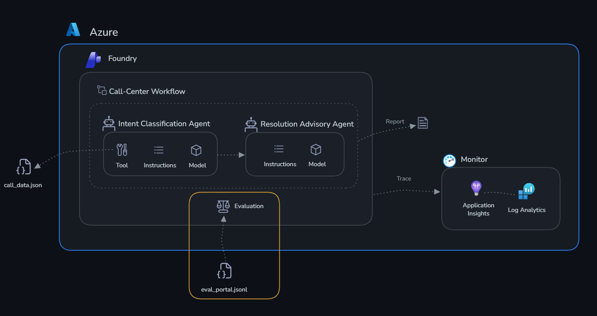

# Challenge 3: Evaluate

Time: ~30 minutes

## Objectives

By the end of this challenge, you will have:

- ✅ Run a systematic evaluation of your Classifier with a 10-case test dataset
- ✅ Used built-in evaluators (coherence and fluency) to measure quality
- ✅ Interpreted the results at aggregate and per-row level
- ✅ Understood how evaluation fits into a release process



## Context

Monitoring tells you **what is happening** (latency, errors, token usage). Evaluation tells you **whether the classifications are actually any good**.

You have a dataset of 10 test cases. Each one is a zone scenario with readings, plus the expected classification. You will run the Classifier against all 10 and score the results with LLM-as-judge evaluators.

## Why evaluate?

Monitoring tells you your agents are *running* — evaluation tells you whether they are doing the *right thing*. These are different questions.

Monitoring captures **operational signals**: latency, token count, error rates, availability. They tell you *how* the system behaves mechanically. Evaluation captures **quality signals**: are the outputs correct, relevant, coherent, and consistent with what you expected? They tell you *whether* the system is fulfilling its purpose.

Without systematic evaluation you rely on spot checks — reading a few responses and judging them by feel. That does not scale, is not repeatable, and will not catch a regression when you edit a prompt or switch models. An evaluation gives you a measurable baseline: a number you can track over time and compare across versions.

Evaluation also catches problems monitoring cannot see. An agent that always responds quickly and without errors, but misreads a threshold, looks perfectly healthy in the monitoring dashboard.

Evaluations should run:

- **Before deployment** — to establish a quality baseline and gate a release on a minimum score
- **After any change** — to instructions, model, tools, or grounding data
- **On a schedule** — to catch drift as the underlying model is updated

Specifically for GreenRise: an agent that classifies ZONE-GAMMA — four critical readings and an active pest infestation — as a warning delays an agronomist visit by a day. Monitoring sees a fast, successful response. Only evaluation catches the error.

---

## The evaluation dataset

The dataset is [eval_portal.jsonl](./eval_portal.jsonl) in this folder. It contains 10 rows, and each row has:

- `query` — the zone scenario sent to the agent
- `ground_truth` — the expected classification, anomalies, urgency, and recommended action

The 10 cases cover all five zones twice, across normal, warning, and critical conditions, with both single-metric and multi-metric violations — including the ZONE-GAMMA pest case.

An example row:

```json
{
  "classification": "warning",
  "anomalies": ["soil moisture below min", "temperature above max"],
  "urgency": "medium",
  "recommended_action": "Irrigate promptly and inspect heat exposure within 24 hours."
}
```

**Download [eval_portal.jsonl](./eval_portal.jsonl) to your machine now** — the portal asks you to browse for a local file.

## About the evaluators

Microsoft Foundry uses an **LLM-as-judge** approach: a separate model reads each agent response along with the input, then assigns a score from 1 to 5. You will use two built-in evaluators:

- **Coherence** — is the response logically structured and internally consistent? A 5 means clear, well organised, and easy to follow. A low score means the output contradicts itself or is hard to read. For the Classifier, this catches things like marking a zone ✅ normal in one column while flagging it 🔴 critical in the priority column.

- **Fluency** — is the response grammatically and linguistically sound? A 5 means well written and natural. A low score means awkward phrasing that reduces confidence in the classification even when the underlying decision is correct.

Together these two give you a quick quality signal. A low coherence score points at the structure of your instructions. A low fluency score points at how you asked the agent to phrase its output.

---

## Step 1 — Open the evaluation wizard

1. Open [ai.azure.com/nextgen](https://ai.azure.com/nextgen) → your project.
2. In the top navigation select **Build** → **Evaluations** → **Create**.

## Step 2 — Configure the evaluation

3. Select **Agent** as the evaluation target.
4. Choose `smart-farm-classifier-agent` from the dropdown.
5. Select **Individual Turns**, then **Existing Dataset**.
6. Select **Upload new dataset**. Enter a name first — for example `aigro-tech-eval` — because the upload button stays disabled until the name is filled in. Then browse for the `eval_portal.jsonl` file you downloaded and confirm the upload.
7. Leave **Field Mapping** and **Configure Agents** as they are.
8. On the **Criteria** step, keep only **Coherence** and **Fluency**. Remove every other evaluator — in particular **uncheck Tool Call Accuracy**, because it scores tool usage in a way this dataset does not support and will always come out poorly. A shorter evaluator list also makes the run much faster.
9. Keep the suggested evaluation name or set your own.
10. **Submit**. The run takes several minutes.

<!-- TODO: screenshot — Evaluations > Create wizard, Criteria step with only Coherence and Fluency checked -->

## Step 3 — Read the results

Results appear on the **Evaluations** page within a few minutes. Select the run name to open it.

There are two ways to read the results, and they answer different questions:

- **Aggregate metrics** — the average score for each evaluator across the 10 cases (for example, an overall coherence of 4.2). This is your quality baseline in a single number — the one you track over time and compare across agent versions.
- **Per-row analysis** — the score for each individual case, so you can see *which scenarios* pulled the average down. The aggregate tells you *whether* a problem exists; the per-row view tells you *where*.

Sort by lowest score and open the worst case. Then ask yourself:

- Was the agent actually wrong, or just phrased awkwardly?
- Which line of the instructions would you change to fix it?
- Would that change break any of the cases that scored well?

> [!TIP]
> Change one line of the Classifier's instructions, then re-run the same evaluation. Comparing two runs on an identical dataset is the entire point — a single score in isolation tells you very little.

---

## Success criteria

- [ ] The evaluation runs on all 10 test cases without errors
- [ ] You can view per-row coherence and fluency scores
- [ ] You identified at least one case where the agent can improve
- [ ] You can explain the difference between aggregate metrics and per-row analysis

Next: [Challenge 4 — Orchestrate](../challenge-4-workflow/README.md)
