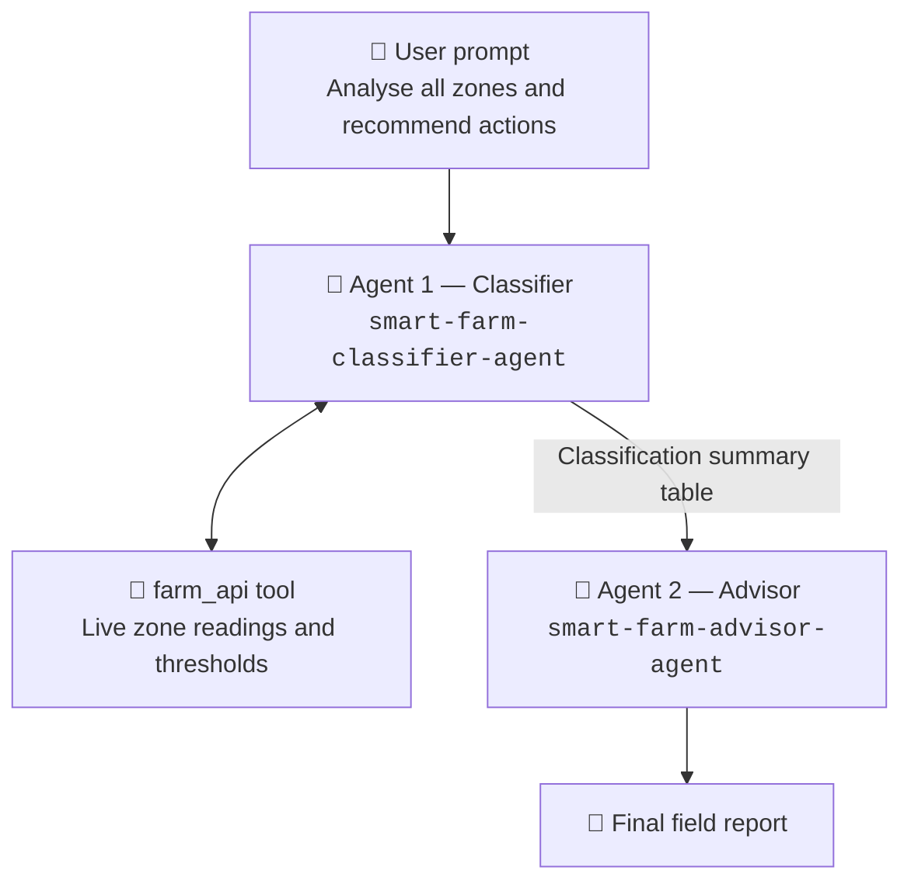

# Challenge 4: Orchestrate with the Workflows designer

Time: ~25 minutes

## Objectives

By the end of this challenge, you will have:

- ✅ A visual workflow that chains your two agents together
- ✅ The Classifier's tool-grounded analysis flowing into the Advisor as context
- ✅ A single run that produces a full morning field report from one prompt
- ✅ An understanding of when to split work across agents instead of writing one big prompt

## Context

Up to now you have run each agent by hand and copied the output between them. That is fine for a playground, not for a farm. In this challenge you connect them once, visually, so a single question produces the whole answer.

### Why two agents instead of one?

You could put every instruction into one agent. You should not:

- **Separation of concerns** — the Classifier is forbidden from recommending anything, so it cannot let an opinion contaminate the data. The Advisor never touches raw readings, so it cannot quietly reclassify a zone to justify its advice.
- **Independent tools** — the Classifier reads the farm API; the Advisor searches treatment documents. Neither needs the other's tool.
- **Independent evaluation** — you evaluated the Classifier alone in Challenge 3. A single merged agent would make it impossible to tell which half was wrong.
- **Independent reuse** — the Classifier is useful on its own for a dashboard; the Advisor is useful on its own for an agronomist.

## Orchestration flow



---

## Step 1 — Create the workflow

1. Open [ai.azure.com/nextgen](https://ai.azure.com/nextgen) → your project.
2. In the top navigation select **Build**, then **Workflows** in the left sidebar.
3. Select **+ New workflow** and name it:

   ```text
   aigro-tech-field-report
   ```

4. The designer opens with a **Start** (input) node and an **End** (output) node.

<!-- TODO: screenshot — Workflows > New workflow, empty designer canvas -->

## Step 2 — Add the Classifier node

1. Select **+ Add node** (or drag from the Start node) and choose **Agent**.
2. Pick `smart-farm-classifier-agent` from the list.
3. Name the node `classify`.
4. Connect **Start → classify**, and set the node's input to the workflow input.

## Step 3 — Add the Advisor node

1. Add a second **Agent** node and pick `smart-farm-advisor-agent`.
2. Name the node `advise`.
3. Connect **classify → advise**.
4. Set the `advise` node's input to the **output of `classify`**. If the designer offers a message template, use something like:

   ```text
   Here is today's zone classification:

   {{classify.output}}

   Recommend actions for the field crew.
   ```

   > [!NOTE]
   > The exact expression syntax for referencing an upstream node's output varies by portal version. Use the node/variable picker the designer offers rather than typing it by hand.

5. Connect **advise → End**.

## Step 4 — Run it

1. Select **Save**, then **Run**.
2. Enter this as the workflow input:

   ```text
   Analyse all zones on the farm using the current sensor data and recommend actions for today.
   ```

3. Watch each node light up as it executes.

## Step 5 — Inspect the run

1. Select the `classify` node in the run view. Confirm it called `farm_api` and produced the classification table — two warning zones, one critical, two normal.
2. Select the `advise` node. Confirm its input contains the Classifier's table, and that its output is three bullets of practical advice with ZONE-GAMMA escalated.
3. Go to **Observability** → **Tracing** and find the run you just made. The workflow appears as one trace with both agent turns and the tool call nested inside it — exactly the view you learned to read in [Challenge 2](../challenge-2-monitor/README.md).

> [!TIP]
> Try changing the workflow input to a single zone, for example *"What should we do about ZONE-EPSILON today?"*, and compare the traces. The Classifier should make a narrower tool call.

---

## Alternative — connected agents

If **Workflows** is not available in your region or tenant, you can get the same behaviour by making the Classifier a tool of the Advisor:

1. Open `smart-farm-advisor-agent` → **Tools** → **+ Add**.
2. Choose **Connected agent** (sometimes shown as **Agent tool** or **Add agent as tool**).
3. Select `smart-farm-classifier-agent`.
4. Give it a description such as:

   ```text
   Classifies GreenRise farm zones against their thresholds and returns a status table. Call this before giving any recommendation.
   ```

5. Test by sending the Advisor: *"Analyse all zones and recommend actions for today."* The Advisor now calls the Classifier itself.

The trade-off: the Advisor decides *whether* to call the Classifier, so the sequence is not guaranteed. A workflow makes the order explicit.

---

## Success criteria

- [ ] The workflow contains both agents, wired Start → classify → advise → End
- [ ] A single run produces both a classification table and a recommendation
- [ ] The `classify` node called the `farm_api` tool
- [ ] The `advise` node's input contains the `classify` node's output
- [ ] The run appears as a single trace under **Observability → Tracing**
- [ ] You can explain why the work is split across two agents

You are done — head to the [wrap up](../wrapup.md) for a recap and cleanup steps.
