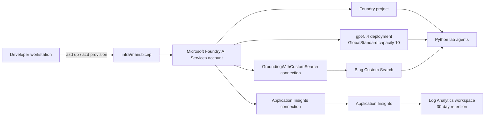

# Azure Infrastructure

This repository provisions the shared Azure foundation used by the Call Center and Smart Farm labs. The source of truth is [`infra/main.bicep`](infra/main.bicep), and [`azure.yaml`](azure.yaml) tells Azure Developer CLI (`azd`) to deploy that Bicep template.

> **Deployment status:** the `azd` environment inspected during this review was `fox-wk`, in resource group `rg-fox-wk`. That resource group was not found in the selected subscription, and the repository context records `azd down`. The resources below describe what the template provisions when deployed; they are not confirmation that the environment is currently running.

## Architecture



## Provisioned resources

| Resource | Azure type | Purpose | Default location or setting |
|---|---|---|---|
| Foundry account | `Microsoft.CognitiveServices/accounts` (`AIServices`) | Hosts the project, model deployment, and Foundry connections | `swedencentral`, SKU `S0` |
| Foundry project | `Microsoft.CognitiveServices/accounts/projects` | Logical project boundary used by the Python SDK and Foundry portal | `swedencentral` |
| Model deployment | `Microsoft.CognitiveServices/accounts/deployments` | Serves the lab's generative model | `gpt-5.4`, version `2026-03-05`, `GlobalStandard`, capacity `10` |
| Bing Custom Search account | `Microsoft.Bing/accounts` (`Bing.GroundingCustomSearch`) | Provides web grounding for agents | Global, SKU `G2` |
| Bing configuration | `Microsoft.Bing/accounts/customSearchConfigurations` | Creates the default Custom Search configuration | `default` |
| Bing Foundry connection | `Microsoft.CognitiveServices/accounts/connections` | Makes Bing available to Foundry agents through `GroundingWithCustomSearch` | Shared to all projects on the account |
| Log Analytics workspace | `Microsoft.OperationalInsights/workspaces` | Stores the workspace-backed Application Insights telemetry | `swedencentral`, 30-day retention |
| Application Insights | `Microsoft.Insights/components` | Receives GenAI traces, request telemetry, errors, latency, and token metrics | `swedencentral`, workspace-based |
| Application Insights Foundry connection | `Microsoft.CognitiveServices/accounts/connections` | Registers Application Insights as a Foundry observability connection | Shared to all projects on the account |

Resource names receive a unique suffix derived from the resource group ID. The default naming pattern is:

- Foundry account: `aif-frontier-<suffix>`
- Foundry project: `prj-frontier-<suffix>`
- Bing Custom Search: `bing-custom-hack-<suffix>`
- Log Analytics: `logs-<suffix>`
- Application Insights: `insights-<suffix>`

## Provisioning flow

From the repository root:

```powershell
az login
azd auth login
azd up
```

`azd` creates or reuses an environment and resource group, deploys `infra/main.bicep`, and stores the Bicep outputs in the `azd` environment. The post-provision hook [`scripts/write-env.ps1`](scripts/write-env.ps1) reads those outputs and writes a root `.env` file for local challenges. The `.env` file is ignored by Git and must not be committed.

To select another subscription, environment, or region, configure the `azd` environment before provisioning. The Bicep `location` parameter defaults to `swedencentral`.

## Application configuration

The hook exports the values consumed by the lab scripts:

| Variable | Bicep output | Used for |
|---|---|---|
| `FOUNDRY_ENDPOINT` | `foundryEndpoint` | Foundry account endpoint |
| `PROJECT_CONNECTION_STRING` | `projectConnectionString` | Project-scoped SDK connection |
| `MODEL_DEPLOYMENT_NAME` | `modelDeploymentName` | Model calls, default `gpt-5.4` |
| `APPLICATIONINSIGHTS_CONNECTION_STRING` | `appInsightsConnectionString` | OpenTelemetry and GenAI tracing |
| `APPINSIGHTS_INSTRUMENTATION_KEY` | `appInsightsInstrumentationKey` | Legacy-compatible Application Insights configuration |

The deployment does not create a separate web application, database, storage account, Kubernetes cluster, or public API. The lab agents run from the participant's Python environment and call Foundry over its endpoint.

## Identity and security

The Foundry account and project use system-assigned managed identities. The current template also sets:

- `publicNetworkAccess: 'Enabled'` on the Foundry account.
- `disableLocalAuth: false`, so local authentication remains enabled.
- Bing credentials in the Foundry connection, sourced from the Bing account key at deployment time.
- Application Insights connection credentials in the Foundry connection.

These settings are suitable for a short-lived workshop, but they are not a production security baseline. A production deployment should evaluate private networking, restricted ingress, Microsoft Entra ID-only authentication where supported, least-privilege role assignments, secret rotation, and policy controls. Do not print or commit generated connection strings or keys.

## Observability path

The Application Insights resource is workspace-based and uses the Log Analytics workspace created by the same template. Challenge 2 enables GenAI tracing from the local Python agents using the generated connection string. Traces can then be inspected in Application Insights and the Microsoft Foundry portal, including model calls, latency, errors, and token usage.

## Scope and known gaps

- **Azure AI Search is not currently provisioned.** `infra/main.bicep` contains no `Microsoft.Search/searchServices` resource or Search connection.
- The Bicep compiler reports `BCP081` warnings for the Bing resource API types because type metadata is unavailable. The template still builds successfully, but deployment should be smoke-tested after API-version changes.
- The template exposes telemetry connection values as deployment outputs so the post-provision hook can create `.env`. Keep deployment output logs private.
- The model name and version are hard-coded defaults. They can be changed by passing Bicep parameters through the `azd` environment when the target model is available in the selected region and subscription.

## Useful verification

After provisioning, verify:

1. The resource group contains the Foundry account, project, model deployment, Bing Custom Search, Log Analytics, and Application Insights resources.
2. The `gpt-5.4` deployment has provisioning state `Succeeded`.
3. The Foundry project is visible in the Foundry portal and can answer a playground request.
4. Both Foundry connections are present and healthy.
5. A sample agent run creates traces in Application Insights.

To remove a workshop environment, use `azd down` from the same `azd` environment. This deletes the provisioned Azure resources and should be treated as destructive.
