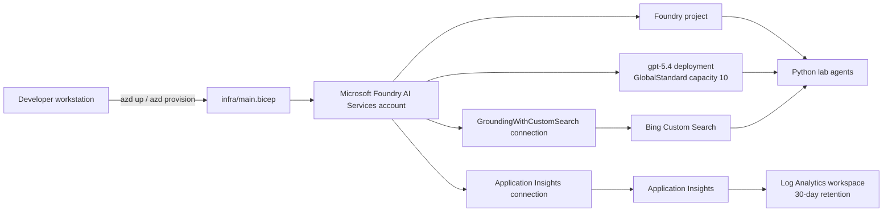

# Azure Infrastructure

This repository provisions the shared Azure foundation used by the Call Center and Smart Farm labs. The source of truth for deployed resources is [`infra/main.bicep`](infra/main.bicep), and [`azure.yaml`](azure.yaml) tells Azure Developer CLI (`azd`) to deploy that Bicep template. The repository does not track whether a particular `azd` environment is currently deployed.

## Architecture



## Provisioned resources

| Resource | Azure type | Purpose | Default location or setting |
|---|---|---|---|
| Foundry account | `Microsoft.CognitiveServices/accounts` (`AIServices`) | Hosts the project, model deployment, and Foundry connections | `swedencentral`, SKU `S0` |
| Foundry project | `Microsoft.CognitiveServices/accounts/projects` | Logical project boundary used by the Python SDK and Foundry portal | `swedencentral` |
| Model deployment | `Microsoft.CognitiveServices/accounts/deployments` | Serves the lab's generative model | `gpt-5.4`, version `2026-03-05`, `GlobalStandard`, capacity `10` |
| Bing Custom Search account | `Microsoft.Bing/accounts` (`Bing.GroundingCustomSearch`) | Provides web grounding for agents | Global, SKU `G2` |
| Bing configuration | `Microsoft.Bing/accounts/customSearchConfigurations` | Creates the default Custom Search configuration | `default` |
| Bing Foundry connection | `Microsoft.CognitiveServices/accounts/connections` | Makes Bing available to Foundry agents through `GroundingWithCustomSearch` | Shared to all projects on the account |
| Log Analytics workspace | `Microsoft.OperationalInsights/workspaces` | Stores the workspace-backed Application Insights telemetry | `swedencentral`, 30-day retention |
| Application Insights | `Microsoft.Insights/components` | Receives GenAI traces, request telemetry, errors, latency, and token metrics | `swedencentral`, workspace-based |
| Application Insights Foundry connection | `Microsoft.CognitiveServices/accounts/connections` | Registers Application Insights as a Foundry observability connection | Shared to all projects on the account |

Resource names receive a unique suffix derived from the resource group ID. The default naming pattern is:

- Foundry account: `aif-frontier-<suffix>`
- Foundry project: `prj-frontier-<suffix>`
- Bing Custom Search: `bing-custom-hack-<suffix>`
- Log Analytics: `logs-<suffix>`
- Application Insights: `insights-<suffix>`

## Provisioning flow

From the repository root:

```powershell
az login
azd auth login
azd up
```

`azd` creates or selects an environment and resource group, deploys `infra/main.bicep`, and stores the Bicep outputs in the `azd` environment. The post-provision hook [`scripts/write-env.ps1`](scripts/write-env.ps1) reads those outputs and writes a root `.env` file for local challenges. The `.env` file is ignored by Git and must not be committed.

To select another subscription or environment, configure `azd` before provisioning. The Bicep `location` parameter defaults to `swedencentral`. The repository does not include a `.bicepparam` or ARM parameters file that overrides the template's model, capacity, naming, or location defaults.

## Application configuration

The hook writes the following values to `.env`:

| Variable | Source | Used for |
|---|---|---|
| `AZURE_SUBSCRIPTION_ID` | `subscriptionId` output | Subscription containing the deployment |
| `RESOURCE_GROUP` | `resourceGroupName` output | Resource group containing the deployment |
| `FOUNDRY_RESOURCE_NAME` | `foundryResourceName` output | Foundry account name |
| `PROJECT_NAME` | `projectName` output | Foundry project name |
| `FOUNDRY_ENDPOINT` | `foundryEndpoint` output | Foundry account endpoint |
| `PROJECT_CONNECTION_STRING` | `projectConnectionString` output | Project-scoped SDK endpoint; despite the variable name, the generated value is an HTTPS URL, not a credential-bearing connection string |
| `MODEL_DEPLOYMENT_NAME` | `modelDeploymentName` output | Model calls, default `gpt-5.4` |
| `APPLICATIONINSIGHTS_CONNECTION_STRING` | `appInsightsConnectionString` output | OpenTelemetry and GenAI tracing |
| `APPINSIGHTS_INSTRUMENTATION_KEY` | `appInsightsInstrumentationKey` output | Legacy-compatible Application Insights configuration |
| `AZURE_EXPERIMENTAL_ENABLE_GENAI_TRACING` | Literal `true` in `write-env.ps1` | Enables experimental GenAI tracing in the Azure SDK instrumentation |
| `OTEL_INSTRUMENTATION_GENAI_CAPTURE_MESSAGE_CONTENT` | Literal `true` in `write-env.ps1` | Enables capture of GenAI message content in telemetry |

The Bicep template also outputs the Bing account name, resource ID, configuration name, and Foundry connection name. The current hook does not copy those four outputs into `.env`.

The deployment does not create a separate web application, database, storage account, Kubernetes cluster, or public API. The lab agents run from the participant's Python environment and call Foundry over its endpoint.

## Facilitator scripts

The scripts under `scripts/` perform tenant and subscription administration separately from `azd`:

- [`hackthon-setup.ps1`](scripts/hackthon-setup.ps1) creates `hack-dev-001`, `hack-dev-002`, and subsequent Microsoft Entra users, creates matching `rg-hack-dev-001`, `rg-hack-dev-002`, and subsequent resource groups, and assigns each user the `Contributor` and `Foundry User` roles on their matching resource group by default.
- The setup script does **not** run `azd` or deploy `infra/main.bicep` into those resource groups. Each participant or facilitator must perform the actual lab deployment separately.
- The current setup implementation assigns the fixed temporary password `P@$$w0rd`, forces a password change at first sign-in, and prints newly assigned temporary passwords in its final output. Treat that output as sensitive and replace the fixed-password implementation before using the script outside a controlled workshop.
- [`hackthon-cleanup.ps1`](scripts/hackthon-cleanup.ps1) deletes Microsoft Entra users and resource groups by name prefix. Its defaults match `hack-dev*` users and `rg-hack-dev*` resource groups. Resource-group deletion is asynchronous by default (`-NoWait $true`). Review the prefixes and active subscription before running it because deletion is destructive.

Running these scripts requires permissions to create and delete Microsoft Entra users, create and delete resource groups, and assign Azure roles. Supplying `-SubscriptionId` changes the active Azure CLI subscription before resource-group operations.

## Identity and security

The Foundry account and project use system-assigned managed identities. The current template also sets:

- `publicNetworkAccess: 'Enabled'` on the Foundry account.
- `disableLocalAuth: false`, so local authentication remains enabled.
- Bing credentials in the Foundry connection, sourced from the Bing account key at deployment time.
- Application Insights connection credentials in the Foundry connection.
- GenAI message-content capture to `true` in the generated local `.env` file.

These settings are suitable for a short-lived workshop, but they are not a production security baseline. A production deployment should evaluate private networking, restricted ingress, Microsoft Entra ID-only authentication where supported, least-privilege role assignments, secret rotation, telemetry content redaction, and policy controls. Do not print or commit generated connection strings, keys, temporary passwords, or captured prompt content.

## Observability path

The Application Insights resource is workspace-based and uses the Log Analytics workspace created by the same template. Challenge 2 enables GenAI tracing from the local Python agents using the generated connection string. Traces can then be inspected in Application Insights and the Microsoft Foundry portal, including model calls, latency, errors, and token usage.

## Scope and known gaps

- **Azure AI Search is not currently provisioned.** `infra/main.bicep` contains no `Microsoft.Search/searchServices` resource or Search connection.
- The Bicep compiler reports `BCP081` warnings for the Bing resource API types because type metadata is unavailable. The template still builds successfully, but deployment should be smoke-tested after API-version changes.
- The template exposes telemetry connection values as deployment outputs so the post-provision hook can create `.env`. Keep deployment output logs private.
- The model deployment defaults to `gpt-5.4`, version `2026-03-05`, with `GlobalStandard` capacity `10`. These are Bicep parameters with defaults, but this repository has no checked-in parameter mapping for overriding them through `azd`. Any override must be wired into the deployment explicitly and must be available in the selected region and subscription.

## Useful verification

After provisioning, verify:

1. The resource group contains the Foundry account, project, model deployment, Bing Custom Search, Log Analytics, and Application Insights resources.
2. The `gpt-5.4` deployment has provisioning state `Succeeded`.
3. The Foundry project is visible in the Foundry portal and can answer a playground request.
4. Both Foundry connections are present and healthy.
5. A sample agent run creates traces in Application Insights.

To remove a workshop environment, use `azd down` from the same `azd` environment. This deletes the provisioned Azure resources and should be treated as destructive.
