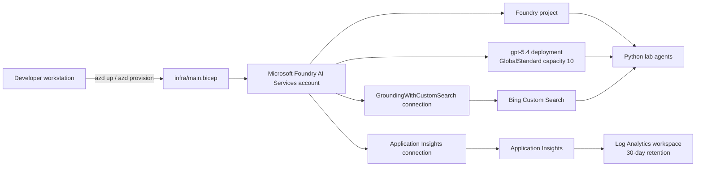

# Azure Infrastructure

This repository provisions the shared Azure foundation used by the Call Center and Smart Farm labs. The source of truth for deployed resources is [`infra/main.bicep`](infra/main.bicep), and [`azure.yaml`](azure.yaml) tells Azure Developer CLI (`azd`) to deploy that Bicep template. The repository does not track whether a particular `azd` environment is currently deployed.

## Architecture

## Provisioned resources

| Resource | Azure type | Purpose | Default location or setting |
|---|---|---|---|
| Foundry account | `Microsoft.CognitiveServices/accounts` (`AIServices`) | Hosts the project, model deployment, and Foundry connections | `swedencentral`, SKU `S0` |
| Foundry project | `Microsoft.CognitiveServices/accounts/projects` | Logical project boundary used by the Python SDK and Foundry portal | `swedencentral` |
| Model deployment | `Microsoft.CognitiveServices/accounts/deployments` | Serves the lab's generative model | `gpt-5.4`, version `2026-03-05`, `GlobalStandard`, capacity `10` |
| Bing Custom Search account | `Microsoft.Bing/accounts` (`Bing.GroundingCustomSearch`) | Provides web grounding for agents | Global, SKU `G2` |
| Bing configuration | `Microsoft.Bing/accounts/customSearchConfigurations` | Creates the default Custom Search configuration | `default` |
| Bing Foundry connection | `Microsoft.CognitiveServices/accounts/connections` | Makes Bing available to Foundry agents through `GroundingWithCustomSearch` | Shared to all projects on the account |
| Log Analytics workspace | `Microsoft.OperationalInsights/workspaces` | Stores the workspace-backed Application Insights telemetry | `swedencentral`, 30-day retention |
| Application Insights | `Microsoft.Insights/components` | Receives GenAI traces, request telemetry, errors, latency, and token metrics | `swedencentral`, workspace-based |
| Application Insights Foundry connection | `Microsoft.CognitiveServices/accounts/connections` | Registers Application Insights as a Foundry observability connection | Shared to all projects on the account |

Resource names receive a unique suffix derived from the resource group ID. The default naming pattern is:

- Foundry account: `aif-frontier-<suffix>`
- Foundry project: `prj-frontier-<suffix>`
- Bing Custom Search: `bing-custom-hack-<suffix>`
- Log Analytics: `logs-<suffix>`
- Application Insights: `insights-<suffix>`

## Provisioning flow

`azd` creates or selects an environment and resource group, deploys `infra/main.bicep`, and stores the Bicep outputs in the `azd` environment. The post-provision hook [`scripts/write-env.ps1`](scripts/write-env.ps1) reads those outputs and writes a root `.env` file for local challenges. The `.env` file is ignored by Git and must not be committed.

To select another subscription or environment, configure `azd` before provisioning. The Bicep `location` parameter defaults to `swedencentral`. The repository does not include a `.bicepparam` or ARM parameters file that overrides the template's model, capacity, naming, or location defaults.

## Application configuration

The hook writes the following values to `.env`:

| Variable | Source | Used for |
|---|---|---|
| `AZURE_SUBSCRIPTION_ID` | `subscriptionId` output | Subscription containing the deployment |
| `RESOURCE_GROUP` | `resourceGroupName` output | Resource group containing the deployment |
| `FOUNDRY_RESOURCE_NAME` | `foundryResourceName` output | Foundry account name |
| `PROJECT_NAME` | `projectName` output | Foundry project name |
| `FOUNDRY_ENDPOINT` | `foundryEndpoint` output | Foundry account endpoint |
| `PROJECT_CONNECTION_STRING` | `projectConnectionString` output | Project-scoped SDK endpoint; despite the variable name, the generated value is an HTTPS URL, not a credential-bearing connection string |
| `MODEL_DEPLOYMENT_NAME` | `modelDeploymentName` output | Model calls, default `gpt-5.4` |
| `APPLICATIONINSIGHTS_CONNECTION_STRING` | `appInsightsConnectionString` output | OpenTelemetry and GenAI tracing |
| `APPINSIGHTS_INSTRUMENTATION_KEY` | `appInsightsInstrumentationKey` output | Legacy-compatible Application Insights configuration |
| `AZURE_EXPERIMENTAL_ENABLE_GENAI_TRACING` | Literal `true` in `write-env.ps1` | Enables experimental GenAI tracing in the Azure SDK instrumentation |
| `OTEL_INSTRUMENTATION_GENAI_CAPTURE_MESSAGE_CONTENT` | Literal `true` in `write-env.ps1` | Enables capture of GenAI message content in telemetry |

The Bicep template also outputs the Bing account name, resource ID, configuration name, and Foundry connection name. The current hook does not copy those four outputs into `.env`.

The deployment does not create a separate web application, database, storage account, Kubernetes cluster, or public API. The lab agents run from the participant's Python environment and call Foundry over its endpoint.