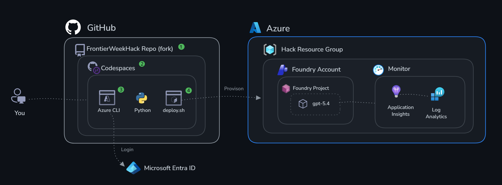
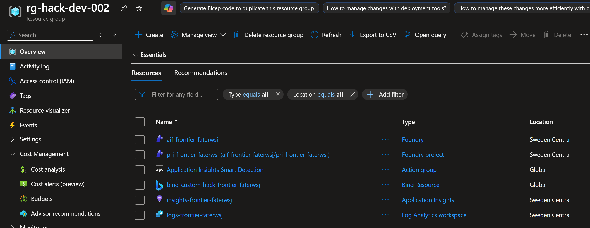
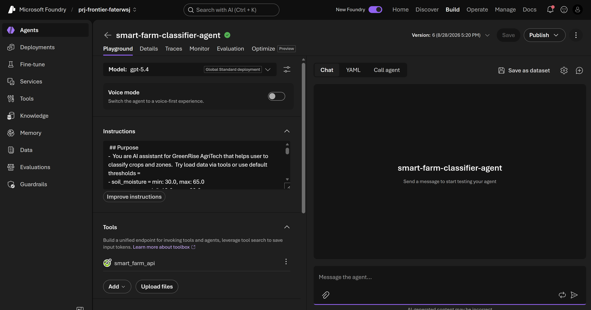

# Challenge 0: Setup and authentication

Tempo: ~20 minutos

## Objectives

By the end of this challenge, you will have:

- ✅ A fully provisioned Microsoft Foundry project with a deployed model
- ✅ Application Insights provisioned with its connection string available
- ✅ Local machine authentication to Foundry verified
- ✅ Confirmation that your agent endpoint is working



## Prerequisites

- Azure subscription with Contributor and Foundry User roles
- Python 3.10 or later
- Azure CLI (`az`) installed and authenticated (`az login`)
- Azure Developer CLI (`azd`) installed
- A terminal (PowerShell, bash or WSL)

### Setup: Local environment

Run everything on your own machine. Requires Python 3.10+ and the Azure CLI.

```bash
# 1. Clone this repo
git clone https://github.com/ms-hack-fy27/FrontierHack-AGRO/.git
cd FrontierHack-AGRO

# 2. Create and activate a virtual environment
python3 -m venv .venv

# Activate venv on Windows: 
.venv\Scripts\activate  # on linux: source .venv/bin/activate

# 3. Install Python dependencies
pip install -r requirements.txt

```

4. Continue to **Deploy infrastructure** below.

## Deploy infrastructure

```bash

az login --tenant <your-tenant-id>
az account show #validate if your using expected subscription
azd auth login
azd up
# Command Prompt
copy .env smart-farm\.env
# PowerShell
Copy-Item .env smart-farm\.env
# Bash
cp .env smart-farm/.env

# Enter a unique environment name: hack-dev-XXX ( each participant must use a different number)
# Create new resource group: rg-hack-dev-XXX
# Recommended Location:  (Europe) Sweden Central (swedencentral)

```

This provisions all resources and writes your `.env` file to the repository root. The command above then copies it to the **smart-farm** folder. Deployment takes a few minutes. To change the region or names, use `azd env set` before running `azd up`.

## Verify resource creation

Open the [Azure portal](https://portal.azure.com/) and find your resource group, which should now contain resources like these:



> [!NOTE]
> Resource name prefixes vary by scenario, and suffixes are unique to each deployment.

Open the [Microsoft Foundry portal](https://ai.azure.com/nextgen) and verify that you can access the Foundry project.


Select **Build** in the top navigation, then **Models**, and verify that the **gpt-5.4** model is deployed.

>[!NOTE]
> In some versions of the Foundry portal, the **Models** tab is named **Deployments**, but both serve the same purpose.


Select **gpt-5.4**, enter a test message in the model playground, and verify that you receive a response.




## Success criteria

- [ ] You can see your Microsoft Foundry project in the Azure portal
- [ ] A gpt-5.4 model deployment shows the status "Succeeded"
- [ ] You can send a test message in the Foundry Model Playground
