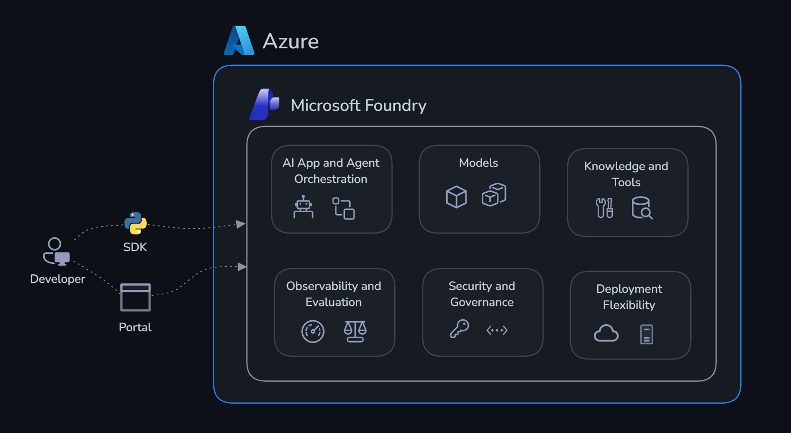
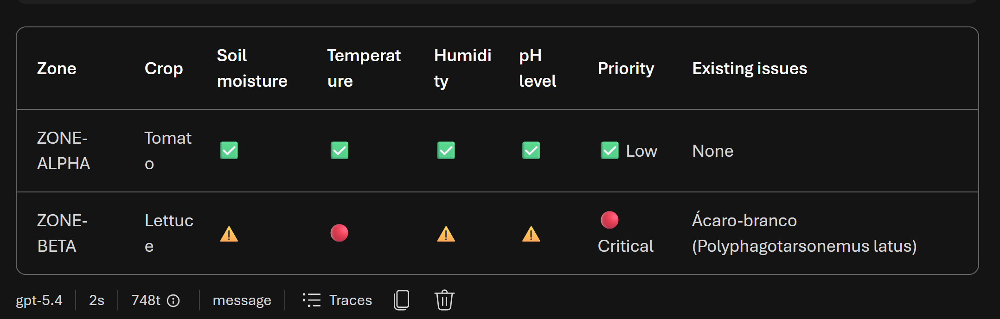

# Challenge 1: Build agents

Time: ~30 minutes

## Objectives

By the end of this challenge, you will have:

- ✅ The **Classifier Agent** that compares each zone's readings with its thresholds and reports status
- ✅ The **Advisory Agent** turns those findings into agronomic recommendations
- ✅ Both agents created in your Foundry project and visible in the portal


## Context

GreenRise AgriTech monitors five growing zones at the Smart Farm Demonstration. Each zone has a crop, four metrics — `soil_moisture`, `temperature`, `humidity`, and `ph_level` — and its own `min` and `max` thresholds, so a reading that is safe in one zone can be an emergency in another. Your agents need to:

1. **Classification**: compare every reading with that zone's thresholds and mark each metric 🔴 critical, ⚠️ warning, or ✅ normal, including any recorded issues
2. **Advisory**: given that classification, recommend irrigation, disease, and escalation actions — and look up treatment products when pests are present

See [smart_farm_data.json](../api-agro/data/smart_farm_data.json) for the current farm snapshot.

## Portal or SDK?

Microsoft Foundry offers two ways to build agents. The **Foundry portal** ([ai.azure.com/nextgen](https://ai.azure.com/nextgen)) provides a visual, no-code interface where you can create agents, attach tools, and test them interactively in a playground — ideal for exploration and rapid prototyping. The **Azure AI Agents SDK** provides full programmatic control: you define agent behavior, tools, and orchestration logic in Python, making versioning, testing, and integration with automated pipelines easier.



In this challenge, we use the **SDK**. The code in [agents.py](./agents.py) creates both agents and runs the classifier — all from the terminal. After the script runs, both agents are also visible in the portal under **Agents**, where you can inspect them, tune their instructions, attach tools, and test them interactively without changing code.

## Agents and tools

### What is an agent?

An agent in Microsoft Foundry is a persistent, stateful AI assistant powered by a large language model. Unlike a simple API call — where you send a prompt and receive a single response — an agent maintains a **conversation thread**, can **invoke tools autonomously**, and **maintains context** across multiple interactions. You configure it with:

- A **name** and a **model** (for example, `gpt-5.4`)
- A **system prompt** — instructions that define its role, personality, and constraints
- One or more **tools** that it can call when it needs information or actions beyond its training data

Agents are managed resources in your Foundry project. They persist across runs, appear in the portal under **Agents**, and can be versioned, shared, and reused.

### What are tools?

Tools extend an agent's capabilities beyond language generation. When the model decides it needs information that is not in the context window, it emits a **tool call** — a structured JSON request specifying the tool name and its arguments. The SDK intercepts the request, executes the corresponding Python function, and returns the result to the model. This reasoning cycle continues until the agent produces a final response.

From the model's perspective, tools are described by a **JSON schema** (name, description, and parameters). The model reads these descriptions and autonomously decides when and how to call them — you never code the decision logic directly.

### Which tools can you add?

| Tool type | What it does | Best for |
|-----------|-------------|----------|
| **OpenAPI** | Calls an API that you define | Existing services such as the farm API in `api-agro` |
| **Code Interpreter** | Lets the agent write and execute Python in a sandbox | Data analysis, chart generation, and file processing |
| **File Search** | Performs semantic search over a Microsoft Foundry knowledge base | Agronomy manuals, crop protocols, and treatment guides |
| **Bing Search** | Searches the web in real time | Pest treatment products and current agronomic guidance |
| **Azure AI Search** | Queries an Azure Search index | Grounded retrieval from your own data at scale |

## Get started

Open [agents.py](./agents.py) and review the implementation of both agents.

In this challenge the two agents are **prompt-only**: `agents.py` creates them with instructions but does not attach a tool yet. That is why the classifier's instructions carry fallback thresholds — it can still classify readings pasted directly into the prompt. Attaching a tool is what grounds it in the real dataset, and you do that in the portal at the end of this challenge.

## Agent responsibilities

- **`smart-farm-classifier-agent`** reports a classification summary table only — one row per zone, one column per metric, marked 🔴 / ⚠️ / ✅, plus a priority column and any recorded issues. Its instructions explicitly forbid recommendations, which keeps classification separate from advice.
- **`smart-farm-advisor-agent`** has no tools of its own. It reasons from the classifier's output using three patterns: low soil moisture with high temperature indicates irrigation stress; high humidity with low pH indicates fungal or disease risk; multiple critical readings require urgent agronomist escalation.

## Run

```powershell
cd smart-farm\challenge-1-build
python agents.py
```

## Run the agents in the portal

1. Open [ai.azure.com/nextgen](https://ai.azure.com/nextgen), select your project, and go to **Agents**.
2. Open `smart-farm-classifier-agent` and test follow prompt

```powershell
Classify follow zones:
    Zone: ZONE-ALPHA
    Crop: Tomato
    Soil moisture: 52
    Temperature: 28
    Humidity: 60
    pH level: 6.5

    Zone: ZONE-BETA
    Crop: Lettuce
    Soil moisture: 70
    Temperature: 40
    Humidity: 90
    pH level: 8
    Issues: Ácaro-branco (Polyphagotarsonemus latus)
```

See follow result:



## Smart Farm data via API

The source dataset is `api-agro/data/smart_farm_data.json`. It contains a snapshot of five zones with crop details, inspection dates, observed issues, and these readings:

- `soil_moisture`
- `temperature`
- `humidity`
- `ph_level`
- `issues`

Each metric has a zone-specific minimum and maximum threshold. The stored statuses are two `warning` zones, one `critical` zone, and two `normal` zones.

The API serves that dataset through:

| Method | Route | Result |
|---|---|---|
| GET | `/farm` | Full farm snapshot |
| GET | `/zones` | All zones; accepts optional `zone_id` |
| GET | `/zones/{zone_id}` | One zone, matched case-insensitively |
| GET | `/zones/{zone_id}/readings` | All metric readings; accepts optional `metric` |
| GET | `/crops` | Crop summaries; accepts a case-insensitive partial `crop` filter |
| GET | `/swagger` | Swagger UI |

Run the API separately from the agent lab:

```powershell
cd smart-farm\api-agro
python -m venv .venv
.venv\Scripts\Activate.ps1
pip install -r requirements.txt
uvicorn main:app --reload
```

Then open `http://127.0.0.1:8000/swagger`. Static OpenAPI documents are checked in as `api-agro/openapi.json` and `api-agro/openapi.yaml`.

## Configure the agents in the portal

The script leaves both agents in your project, so finish the challenge in the portal:

1. Open [ai.azure.com/nextgen](https://ai.azure.com/nextgen), select your project, and go to **Agents**.
2. Open `smart-farm-classifier-agent` and attach the farm data as an **OpenAPI** tool using `api-agro/openapi.json`, so it reads real zone readings instead of values pasted into the prompt. Start the API first, as shown above.
3. Open `smart-farm-advisor-agent` and add the **Grounding with Bing Custom Search** tool, which its instructions already expect for pest product recommendations.
4. Test both in the playground: ask the classifier for the status of all five zones, then pass its answer to the advisor.

## Success criteria

- [ ] `python agents.py` runs without errors and both agents appear in the portal under **Agents**.
- [ ] The classifier returns a summary table covering all four metrics with 🔴 / ⚠️ / ✅ and a priority column.
- [ ] With the farm data attached, the classifier identifies two warning zones, one critical zone, and two normal zones.
- [ ] The advisor recommends an irrigation action for low soil moisture plus high temperature.
- [ ] The advisor recommends fungal or disease investigation for high humidity plus low pH.
- [ ] Multiple critical readings produce urgent agronomist escalation.
